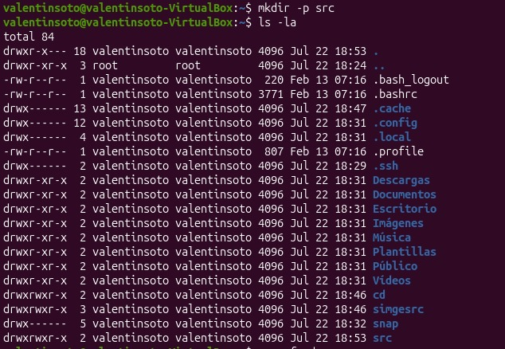
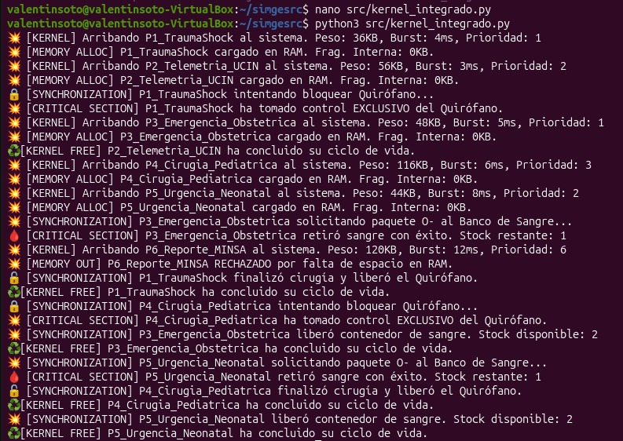
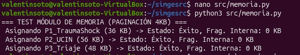
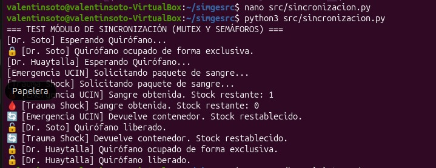

# EVIDENCIAS DE EJECUCIÓN Y VALIDACIÓN EN UBUNTU

Este documento reúne la evidencia fotográfica y las capturas de pantalla del despliegue, preparación del entorno y prueba de los componentes del sistema **SIMGESRC** sobre el sistema operativo **Ubuntu Linux**.

# Figura

## Figura 1. Creación de la Estructura del Proyecto

## Figura 2. Verificando la crearcion del proyecto

## Figura 3. Módulo de Memoria

## Figura 4. Módulo de Sincronización

## Figura 5. Kernel Integrado

